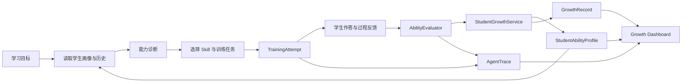

# StudentCoach

> 面向学生能力提升的 AI Growth Agent

StudentCoach 将学习目标、能力诊断、个性化训练、过程反馈、能力评价和长期成长记录连接成一个可追溯闭环。它不是一次性问答机器人，也不是招聘面试工具；系统关注的是学生当前能力证据、训练过程和跨轮次变化。

项目采用 Go + Eino Graph 构建受业务规则约束的 Agent 工作流，配套 React Web 客户端、RAG、长期记忆、Skill、Tool Calling、语音交互、业务 Trace 和离线评测。

## 核心特点

- **长期能力画像**：持续维护逻辑思维、沟通表达、问题解决、批判性思维和反思能力。
- **个性化训练**：结合学习目标、当前短板、历史记录、Skill 和 RAG 案例生成训练任务。
- **训练事实一致性**：通过 `TrainingAttempt` 固化任务、问题、回答、评价量规、评价结果和能力变化。
- **可信成长写入**：LLM 只能调用只读 Tool；能力画像与成长记录由 Go Service 在评价完成后写入。
- **业务级可观测性**：`AgentTrace` 记录意图、Skill 选择、Tool 调用摘要、Memory 使用、训练事实和能力变化。
- **成长数据查询**：Dashboard API 聚合当前画像、最近训练、成长趋势和下一步建议。
- **多模态交互**：支持文字训练、TTS 问题朗读、实时 ASR 与 HTTP 降级识别。
- **可重复验证**：提供基于 mock LLM 的离线 Evaluation Benchmark 和完整 Go 测试。

## 能力成长闭环



一次训练的关键关系为：

```text
AgentTrace
  └── TrainingAttempt
        └── EvaluationResult
              └── GrowthRecord
                    └── StudentAbilityProfile
```

这条事实链保证推荐任务、实际问题、学生回答、评分依据和最终成长记录能够互相追溯。

## 架构说明

StudentCoach 是一个由 Eino Graph 编排的单 Agent 训练系统，不将固定节点包装成 Multi-Agent。

```text
React Web
   │  REST / WebSocket
   ▼
HTTP Handler
   │
   ├── Authentication / Speech
   ├── AgentTrace Query
   └── Growth Dashboard
            │
            ▼
Eino Graph Training Workflow
   │
   ├── AbilityAnalyzer
   ├── StudentProfileAnalyzer
   ├── QuestionPlanner
   ├── StudentCoach
   ├── AbilityEvaluator
   └── GrowthPlanner
            │
            ▼
Domain Services
   ├── StudentGrowthService
   ├── AgentTraceService
   └── StudentGrowthDashboardService
            │
            ▼
Redis / MySQL / Milvus / BM25
```

### Graph 流程

```text
ability_analysis
  → student_profile_analysis
  → question_plan
  → training
  → weak_review（条件分支）
  → evaluation
  → growth_plan
```

Graph 拓扑固定，节点负责明确的领域职责；Skill 影响训练策略，但不直接操作存储。

## 领域模型

| 模型 | 职责 |
|---|---|
| `StudentAbilityProfile` | 当前能力分数、优势、短板和跨轮成长历史 |
| `AbilityGrowthRecord` | 一轮训练前后分数、变化量及 TrainingAttempt 关联 |
| `TrainingAttempt` | 一次任务、提问、回答、评价和能力变化的唯一事实 |
| `EvaluationResult` | 评价分数、反馈、命中点、遗漏点和追问判断 |
| `AgentTrace` | Agent 决策、Tool、Memory、训练事实及能力变化摘要 |
| `StudentGrowthDashboard` | 面向学生展示的成长聚合视图 |

能力分范围为 `0～1`。Dashboard 不重新计算能力，只展示已保存画像和成长记录。

## Tool 权限边界

Agent Runtime 默认只注册只读 Tool：

- `get_student_profile`
- `get_growth_history`
- `get_ability_report`
- `search_training_case`
- `recommend_training_task`

以下写操作不向 LLM 开放：

- `update_ability_profile`
- `save_growth_record`

长期数据写入链路固定为：

```text
TrainingAttempt
  → AbilityEvaluator
  → StudentGrowthService
  → update profile
  → save growth record
```

因此类似“把我的能力分改成 90 分”的提示不会直接触发画像写入。

## Agent Trace

`AgentTrace` 按 session 记录：

- 归一化后的学生目标；
- 选择的 Skill 和决策原因；
- Tool 名称、成功状态、耗时和安全摘要；
- Memory 使用摘要；
- 关联的 TrainingAttempt ID；
- 训练前后能力分；
- 执行状态和时间。

Trace 不保存 token、完整 Prompt、完整学生答案或敏感个人信息。

查询接口：

```http
GET /api/trace/{session_id}
Authorization: Bearer <token>
```

## Growth Dashboard

Dashboard 将 `StudentAbilityProfile`、`GrowthRecord`、`TrainingAttempt` 和 `AgentTrace` 聚合为学生侧成长视图。

```http
GET /api/student/growth/dashboard?student_id=student-001
Authorization: Bearer <token>
```

响应示例：

```json
{
  "student_id": "student-001",
  "abilities": {
    "communication": {
      "score": 0.65,
      "trend": "up",
      "recent_change": 0.1,
      "evidence": ["回答结构比之前完整"]
    }
  },
  "recent_trainings": [
    {
      "session_id": "session-001",
      "training_attempt_id": "attempt-001",
      "skill": "communication-training",
      "result": "completed",
      "learning_goal": "提升表达能力"
    }
  ],
  "strengths": ["能够主动澄清问题"],
  "weaknesses": ["表达结构"],
  "growth_trend": [
    {
      "session_id": "session-001",
      "ability": "communication",
      "score": 0.65,
      "change": 0.1
    }
  ],
  "next_recommendations": ["继续进行表达训练"]
}
```

## 技术栈

| 层次 | 技术 |
|---|---|
| Backend | Go 1.26.1、Eino、Gorilla WebSocket |
| Frontend | React 19、TypeScript、Vite 8、Tailwind CSS、Zustand |
| Model | DashScope / OpenAI-compatible Chat Model |
| RAG | Milvus、BM25、融合检索、Cross-Encoder/LLM 重排 |
| Memory | Redis、MySQL |
| Authentication | JWT |
| Speech | DashScope TTS、Realtime ASR、HTTP ASR fallback |
| Evaluation | Go Test、mock LLM Benchmark |

## 项目结构

```text
.
├── interview-agent-back-end/
│   └── interview-agent/
│       ├── cmd/                 # CLI 与 Web 服务入口
│       ├── evaluation/          # 离线 Agent Benchmark
│       └── internal/
│           ├── agent/           # Agent 领域组件
│           ├── graph/           # Eino Graph 编排
│           ├── handler/         # HTTP / WebSocket
│           ├── memory/          # Redis、MySQL、内存存储
│           ├── model/           # 领域模型
│           ├── rag/             # 检索、融合与重排
│           ├── service/         # 成长、Trace、Dashboard 服务
│           ├── skill/           # 能力训练策略
│           ├── speech/          # TTS / ASR
│           └── tool/            # Tool 注册与权限分类
└── interview-agent-web/
    └── interview-agent-web/
        ├── public/
        ├── scripts/
        └── src/
```

## 快速开始

### 环境要求

- Go 1.26.1，或启用 Go 自动工具链；
- Node.js 20.19+ 或 22.12+；
- npm；
- Docker Compose；
- DashScope API Key。

### 1. 启动基础设施

```bash
cd interview-agent-back-end/interview-agent
cp .env.example .env
# 编辑 .env，至少设置 DASHSCOPE_API_KEY 和安全的 JWT_SECRET
docker compose up -d
```

Windows PowerShell 可使用：

```powershell
Copy-Item .env.example .env
docker compose up -d
```

默认依赖端口：

| 服务 | 端口 |
|---|---:|
| Backend API | 9090 |
| Milvus | 19530 |
| Redis | 36379 |
| MySQL | 33306 |
| MinIO API / Console | 9000 / 9001 |

### 2. 启动后端

```bash
go run cmd/main.go web
```

健康检查：

```bash
curl http://localhost:9090/health
```

### 3. 启动前端

```bash
cd ../../interview-agent-web/interview-agent-web
npm install
npm run dev
```

浏览器访问：<http://localhost:5173>

### 4. 可选：加载训练资料

```bash
go run cmd/main.go load-data
go run cmd/main.go load-data <file-path>
```

## 接口概览

| 方法 | 路径 | 用途 |
|---|---|---|
| GET | `/health` | 健康检查 |
| POST | `/api/register` | 学生注册 |
| POST | `/api/login` | 学生登录 |
| GET | `/api/trace/{session_id}` | 查询一次训练的业务 Trace |
| GET | `/api/student/growth/dashboard?student_id=...` | 查询学生成长画像 |
| GET | `/api/speech/capabilities` | 查询语音能力与开关 |
| POST | `/api/speech/tts` | 文本转语音 |
| WebSocket | `/ws` | 学生训练会话 |
| WebSocket | `/ws/speech/asr` | 实时语音识别 |

除健康检查和未启用认证的本地开发场景外，学生数据接口应携带 JWT。Dashboard 会阻止已认证用户读取其他学生的数据。

## 配置

后端配置模板位于 [`.env.example`](interview-agent-back-end/interview-agent/.env.example)，主要包括：

- Chat Model、Embedding Model 和 Reranker；
- Milvus、Redis、MySQL；
- JWT Secret；
- GitHub Token；
- Speech 开关、模型、并发、大小和超时；
- Web Origin 白名单。

语音能力默认关闭。生产环境必须替换默认 JWT Secret，并设置精确的 HTTPS Origin。

不要提交真实 API Key、JWT Secret、学生完整回答、语音内容或其他个人敏感信息。

## 测试与验证

后端：

```bash
cd interview-agent-back-end/interview-agent
go test ./...
go vet ./...
go test -v ./evaluation
```

前端：

```bash
cd interview-agent-web/interview-agent-web
npm run build
npm run lint
```

涉及语音链路时：

```bash
npm run verify:phase8
```

Evaluation Benchmark 使用 mock LLM 验证确定性编排、Skill 选择、Tool 权限、能力诊断和成长闭环。它不代表真实模型面对开放输入时的准确率。

## 当前边界

- 当前是 Graph 编排的单 Agent 工作流，不是动态协作的 Multi-Agent 系统。
- 历史 WebSocket、存储和工程标识仍保留兼容映射，新代码使用 StudentCoach 领域语言。
- AgentTrace 是项目内部业务可观测能力，不替代 OpenTelemetry、Jaeger 等基础设施链路系统。
- Dashboard 当前提供后端 API，前端尚无独立成长看板页面。
- 系统用于学习训练和形成性反馈，不替代正式教育评价、升学或高风险决策。

## 相关文档

- [后端说明](interview-agent-back-end/interview-agent/README.md)
- [前端说明](interview-agent-web/interview-agent-web/README.md)
- [Evaluation Benchmark](interview-agent-back-end/interview-agent/evaluation/README.md)

## License

当前仓库尚未附带开源许可证。未经项目维护者授权，请勿擅自分发或用于商业用途。
