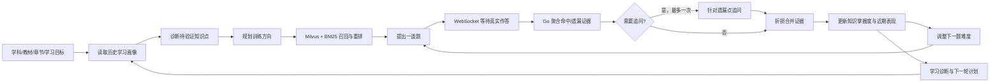

# Student-Coach

> AI 自适应学习训练与知识掌握诊断系统

Student-Coach 面向具体学科、教材章节和知识点，依据学生真实作答持续调整题目、支架、追问和难度，并输出可追溯的知识掌握诊断。核心闭环是：**学习状态分析 → 训练规划 → 题目检索 → 作答评价 → 动态追问 → 掌握度更新 → 下一轮训练**。

项目使用 Go + Eino Graph 编排受规则约束的学习闭环，配套 React Web、WebSocket 人在环交互、Milvus + BM25 RAG、跨轮长期记忆、学习策略 Skill、受权限控制的 Tool、MCP 资料抓取以及 ASR/TTS。

## 核心特点

- **知识层级建模**：训练标准、方向、题目和训练事实均可携带 `subject / textbook / chapter / knowledge_point`。
- **真实人在环**：Graph 在每道题和追问处通过 WebSocket 阻塞等待学生输入，不模拟学生答案。
- **掌握度主画像**：`StudentAbilityProfile.knowledge_mastery` 记录 0～1 的跨轮掌握度；原五维能力分仅作为兼容视图。
- **自适应闭环**：最近三题表现、当前知识点掌握度、连续对错和训练阶段共同决定后续难度。
- **受控追问**：每题最多追问一次；追问属于带支架证据，按 0.85 折损后与主答合并，同一题只更新一次掌握度。
- **可追溯事实**：`TrainingAttempt` 固化学科、章节、知识点、实际难度、问题、回答、量规、评分、提示和掌握度变化。
- **可信写入**：LLM Runtime 只绑定只读 Tool；报告、知识掌握画像和学习轨迹由 Go Service 根据已评价事实写入。
- **多模态交互**：支持文字、TTS 朗读、Realtime ASR，并在实时识别不可用时降级到 HTTP ASR。

## 自适应学习闭环



关键事实链：

```text
PlannedQuestion
  └── TrainingAttempt
        ├── EvaluationResult
        ├── KnowledgeMasteryChanges
        └── Follow-up TrainingAttempt（可选，最多一次）
              └── EvaluationReport
                    └── StudentAbilityProfile
```

这条链保证目标知识点、检索题、实际提问、学生回答、追问、评分依据和最终掌握度能够互相追溯。

## 架构说明

Student-Coach 是 Eino `compose.Graph` 编排的单 Agent 工作流；各 Agent 是固定领域组件，不宣称动态 Multi-Agent 协作。

```text
React Web
   │ REST / WebSocket / Speech WebSocket
   ▼
HTTP + WebSocket Handler
   ├── JWT / Origin
   ├── 人在环答案通道
   └── TTS / Realtime ASR / HTTP ASR fallback
             │
             ▼
Eino Graph
   ├── learning_goal_analysis
   ├── learner_state_analysis
   ├── training_planning（含题库检索）
   ├── adaptive_training（提问 → 等待 → 评价 → 追问 → 掌握度 → 难度）
   ├── targeted_review
   ├── session_summary
   └── next_training_plan
             │
             ▼
Go Domain Services
   ├── StudentGrowthService
   ├── AgentTraceService
   └── Dashboard Service
             │
             ▼
Redis / MySQL / Milvus / BM25
```

### Graph 流程

```text
learning_goal_analysis
  → learner_state_analysis
  → training_planning
  → adaptive_training
  → targeted_review（有已作答内容时）
  → session_summary
  → next_training_plan
```

`adaptive_training` 内部才是逐题动态循环；Graph 不会预先生成学生回答。聊天入口另有 Skill Runtime，注册 `concept-tutor`、`quick-quiz`、`error-review`、`guided-practice`、`knowledge-compare` 五种学习策略。Skill Runtime 与完整 Graph 是两条真实但独立的入口，不宣称 Graph 会自动调用 Skill Registry。

## 领域模型

| 模型 | 职责 |
|---|---|
| `AbilityStandard` | 学科、教材、章节、知识点和兼容能力要求 |
| `LearningDiagnosis` | 训练前的掌握度假设、待验证知识点和证据缺口 |
| `StudentAbilityProfile` | 跨轮知识掌握度、近期表现、薄弱点与兼容能力分 |
| `PlannedQuestion` | 绑定唯一主知识点、题型、难度、来源和参考要点 |
| `TrainingAttempt` | 一次真实提问—作答—评价—提示—掌握度变化的事实 |
| `EvaluationReport` | 本轮知识掌握度、薄弱知识点、训练指标和逐题证据 |
| `AgentTrace` | 决策、Tool、Memory、训练事实和变化摘要 |

跨轮 `knowledge_mastery` 范围为 0～1；报告中的掌握度为 0～100。LLM 提取命中与遗漏证据，Go 负责数值评分、追问折损、画像合并和难度规则。

## RAG 与 Memory 的真实边界

在线出题会分别调用 Milvus 向量召回和 BM25 关键词召回，按文档 ID 去重、拼接候选，再用现有 Reranker 选题；`fusion.go` 中虽然实现了 RRF，但当前在线 Graph 没有调用它，因此本项目不宣称线上已使用 RRF。

检索查询包含学科、教材、章节、知识点和方向关键词；有教育元数据的文档会做匹配过滤，同一文档不会跨训练方向重复使用。历史无元数据题库仍可兼容召回。

会话内状态由 Graph 显式维护在 `TrainingState`（问答、训练事实、近期分数、当前知识点和掌握度）；跨轮数据由 Redis/MySQL 中的 `StudentAbilityProfile`、报告和历史记录承载。代码中构造的 Eino `shortTermMem` 尚未进入核心 Graph 数据通路，不作为已完成能力宣传。

## Tool 权限边界

Runtime 保留以下只读 Tool ID 以兼容既有调用，但描述和返回值已转为学习语义：

- `get_student_profile`
- `get_ability_profile`（包含 `knowledge_mastery`）
- `get_growth_history`
- `get_ability_report`
- `search_training_case`
- `recommend_training_task`

`update_ability_profile` 与 `save_growth_record` 已注册为写 Tool，但不绑定给 LLM ReAct Agent。可信写入链固定为：

```text
TrainingAttempt → Go evidence aggregation → EvaluationReport
               → StudentGrowthService → StudentAbilityProfile / history
```

因此学生要求“直接改分”不会绕过真实作答和 Go 评价流程。

## Agent Trace

`AgentTrace` 按 session 记录：

- 归一化后的学生目标；
- 选择的 Skill 和决策原因；
- Tool 名称、成功状态、耗时和安全摘要；
- Memory 使用摘要；
- 关联的 TrainingAttempt ID；
- 训练前后学习状态变化；
- 执行状态和时间。

Trace 不保存 token、完整 Prompt、完整学生答案或敏感个人信息。

查询接口：

```http
GET /api/trace/{session_id}
Authorization: Bearer <token>
```

## Learning Progress Dashboard

Dashboard 将 `StudentAbilityProfile`、`GrowthRecord`、`TrainingAttempt` 和 `AgentTrace` 聚合为学生侧学习轨迹视图。代码中的类型名与 JSON 字段名为历史兼容名称，页面语义以知识掌握状态为准。

```http
GET /api/student/growth/dashboard?student_id=student-001
Authorization: Bearer <token>
```

响应示例：

```json
{
  "student_id": "student-001",
  "abilities": {
    "communication": {
      "score": 0.65,
      "trend": "up",
      "recent_change": 0.1,
      "evidence": ["回答结构比之前完整"]
    }
  },
  "recent_trainings": [
    {
      "session_id": "session-001",
      "training_attempt_id": "attempt-001",
      "skill": "communication-training",
      "result": "completed",
      "learning_goal": "掌握函数单调性的判定方法"
    }
  ],
  "strengths": ["能够正确使用定义判断单调区间"],
  "weaknesses": ["导数符号与单调性的对应关系"],
  "growth_trend": [
    {
      "session_id": "session-001",
      "ability": "函数单调性",
      "score": 0.65,
      "change": 0.1
    }
  ],
  "next_recommendations": ["完成一组导数判定单调性的分层练习"]
}
```

## 技术栈

| 层次 | 技术 |
|---|---|
| Backend | Go 1.26.1、Eino、Gorilla WebSocket |
| Frontend | React 19、TypeScript、Vite 8、Tailwind CSS、Zustand |
| Model | DashScope / OpenAI-compatible Chat Model |
| RAG | Milvus + BM25 独立召回、ID 去重、候选拼接、Cross-Encoder/LLM 重排 |
| Memory | Redis、MySQL |
| Authentication | JWT |
| Speech | DashScope TTS、Realtime ASR、HTTP ASR fallback |
| Evaluation | Go Test、mock LLM Benchmark |

## 项目结构

```text
.
├── backend/
│   ├── cmd/                 # CLI 与 Web 服务入口
│   ├── evaluation/          # 离线 Agent Benchmark
│   └── internal/
│       ├── agent/           # Agent 领域组件
│       ├── graph/           # Eino Graph 编排
│       ├── handler/         # HTTP / WebSocket
│       ├── memory/          # Redis、MySQL、内存存储
│       ├── model/           # 领域模型
│       ├── rag/             # 向量/关键词检索、去重与重排；RRF 为未接线实验实现
│       ├── service/         # 学习画像、Trace、Dashboard 服务
│       ├── skill/           # 学习策略 Skill 与兼容能力 Skill
│       ├── speech/          # TTS / ASR
│       └── tool/            # Tool 注册与权限分类
└── web/
    ├── public/
    ├── scripts/
    └── src/
```

## 快速开始

### 环境要求

- Go 1.26.1，或启用 Go 自动工具链；
- Node.js 20.19+ 或 22.12+；
- npm；
- Docker Compose；
- DashScope API Key。

### 1. 启动基础设施

```bash
cd backend
cp .env.example .env
# 编辑 .env，至少设置 DASHSCOPE_API_KEY 和安全的 JWT_SECRET
docker compose up -d
```

Windows PowerShell 可使用：

```powershell
Copy-Item .env.example .env
docker compose up -d
```

默认依赖端口：

| 服务 | 端口 |
|---|---:|
| Backend API | 9090 |
| Milvus | 19530 |
| Redis | 36379 |
| MySQL | 33306 |
| MinIO API / Console | 9000 / 9001 |

### 2. 启动后端

```bash
go run cmd/main.go web
```

健康检查：

```bash
curl http://localhost:9090/health
```

### 3. 启动前端

```bash
cd ../web
npm install
npm run dev
```

浏览器访问：<http://localhost:5173>

### 4. 可选：加载训练资料

```bash
go run cmd/main.go load-data
go run cmd/main.go load-data <file-path>
```

## 接口概览

| 方法 | 路径 | 用途 |
|---|---|---|
| GET | `/health` | 健康检查 |
| POST | `/api/register` | 学生注册 |
| POST | `/api/login` | 学生登录 |
| GET | `/api/trace/{session_id}` | 查询一次训练的业务 Trace |
| GET | `/api/student/growth/dashboard?student_id=...` | 查询知识掌握画像与学习轨迹 |
| GET | `/api/speech/capabilities` | 查询语音能力与开关 |
| POST | `/api/speech/tts` | 文本转语音 |
| WebSocket | `/ws` | 学生训练会话 |
| WebSocket | `/ws/speech/asr` | 实时语音识别 |

除健康检查和未启用认证的本地开发场景外，学生数据接口应携带 JWT。Dashboard 会阻止已认证用户读取其他学生的数据。

## 配置

后端配置模板位于 [`.env.example`](backend/.env.example)，主要包括：

- Chat Model、Embedding Model 和 Reranker；
- Milvus、Redis、MySQL；
- JWT Secret；
- GitHub Token；
- Speech 开关、模型、并发、大小和超时；
- Web Origin 白名单。

语音能力默认关闭。生产环境必须替换默认 JWT Secret，并设置精确的 HTTPS Origin。

不要提交真实 API Key、JWT Secret、学生完整回答、语音内容或其他个人敏感信息。

## 测试与验证

后端：

```bash
cd backend
go test ./...
go vet ./...
go test -v ./evaluation
```

前端：

```bash
cd web
npm run build
npm run lint
```

涉及语音链路时：

```bash
npm run verify:phase8
```

Evaluation Benchmark 使用 mock LLM 验证确定性编排、Skill 选择、Tool 权限、知识诊断和长期知识掌握画像写入。它不代表真实模型面对开放输入时的准确率。

## 当前边界

- 当前是 Graph 编排的单 Agent 工作流，不是动态协作的 Multi-Agent 系统。
- 后端仅在协议边界继续接受 `start_interview / quit_interview`；前端核心模型已只使用 training 事件。
- Go module、物理目录、MySQL 表/列、Redis key 和部分 `InterviewRecord` 类型名保留历史兼容；这些名称不作为产品展示名称，也不做破坏性迁移。
- 在线 RAG 尚未接入 `fusion.go` 的 RRF；会话 Graph 尚未使用构造出的 Eino `shortTermMem`。
- Web Scraper MCP 用于 URL 学习资料抽取；GitHub MCP 只参与可选资源推荐，不是出题和评分依赖。
- AgentTrace 是项目内部业务可观测能力，不替代 OpenTelemetry、Jaeger 等基础设施链路系统。
- Dashboard 当前提供后端 API，前端尚无独立学习轨迹页面。
- 系统用于学习训练和形成性反馈，不替代正式教育评价、升学或高风险决策。

## 相关文档

- [后端说明](backend/README.md)
- [前端说明](web/README.md)
- [Evaluation Benchmark](backend/evaluation/README.md)
- [项目技术问答](Student-Coach项目技术问答-Go.md)

## License

当前仓库尚未附带开源许可证。未经项目维护者授权，请勿擅自分发或用于商业用途。
